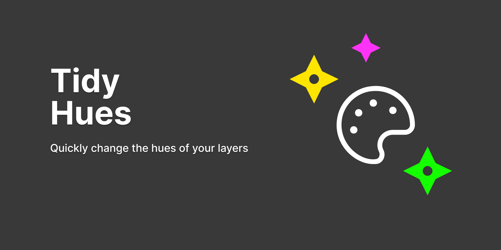

# Tidy Hues

Tidy Hues is a Figma plugin that allows you change just the hue of any layers you have selected.

## Getting Started

When you first start the plugin, you will be greeted with an interface that has a number input, a slider, and an Apply button. As soon as you enter a number in the text field or use the slider, the button will change to the color of your currently selected hue.

If you select some layers in your file that have any Solid or Gradient fills, and hit the Apply button, it will change all of the hue values of the colors in those layers to the hue you have selcted in the plugin. The saturation, lightness, and opacity of your layers will all remain the same.

## Found a bug or have an idea?

This is a team of **one**, but if you have any good ideas or constructive feedback, please do not hesitate to share your thoughts [by creating a new issue](https://github.com/cross-team/figma-hues/issues/new) - screen captures are welcomed.

## Show your support

If you find this plugin useful, feel free to [buy me a 🍺](https://www.patreon.com/mpaiva) at my Patreon page. Thanks! 🙏
 
## Contribute
- Run `yarn` to install dependencies.
- Run `yarn build:watch` to start webpack in watch mode.
- Open `Figma` > `Plugins` > `Development` > `New Plugin...` and choose manifest.json file from this repo.
- Create a Pull Request for your branch
